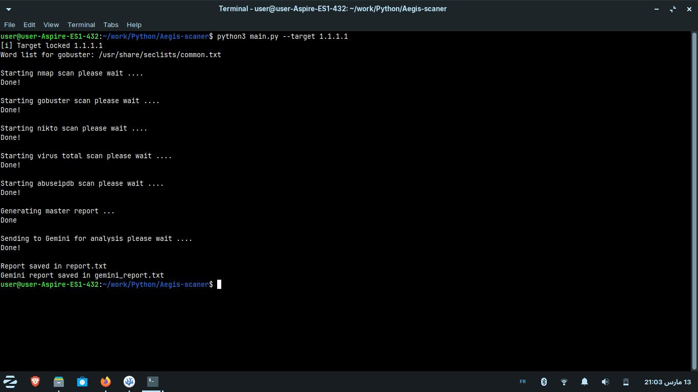
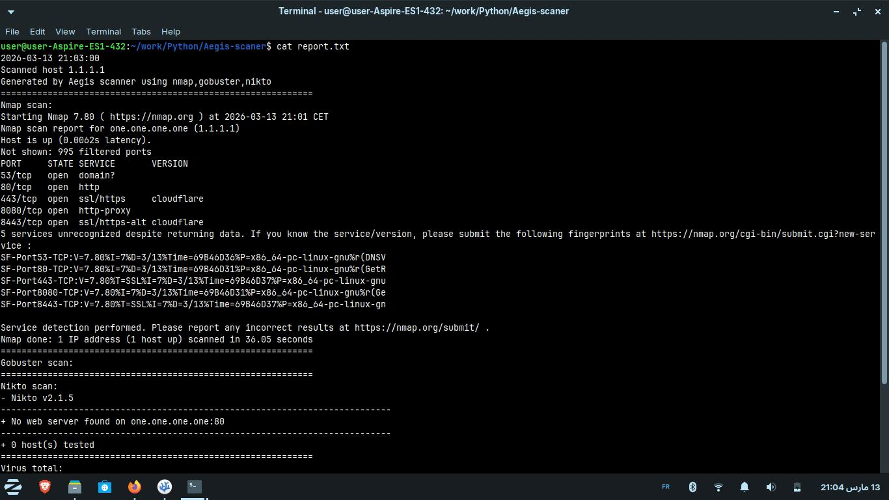
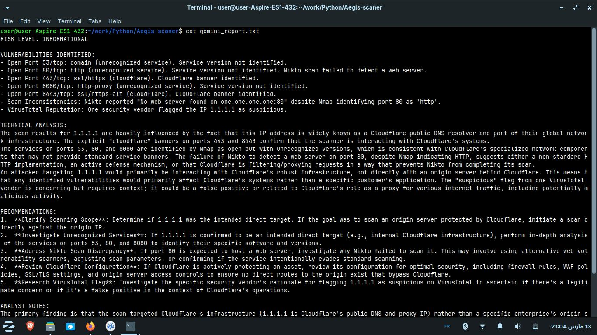

# Aegis-Scan

A Python CLI tool that runs recon scans, grabs threat intel on what it finds, and then has an AI take a crack at telling you what actually matters.

## What It Does

You point Aegis-Scan at a target, and it:

1. **Runs Nmap** to find open ports and identify services + versions
2. **Enumerates directories** with Gobuster (using a wordlist you specify)
3. **Scans for web vulns** with Nikto — misconfigs, bad headers, the usual suspects
4. **Looks up IP reputation** via VirusTotal and AbuseIPDB (so you know if it's already flagged as malicious)
5. **Sends everything to Google Gemini** for AI-powered analysis that actually summarizes what you should care about

The final output lands in two files: a raw master report with all the scan data, and a cleaner AI-generated assessment.

## Why Build This?

I was doing a lot of manual recon work and realized I was wasting time sifting through scan output to figure out what was actually interesting. Aegis-Scan automates the grunt work and lets an AI help surface the real findings instead of drowning in noise.

## What You Need

- **Python 3.8+** (probably newer is fine)
- **Nmap**, **Nikto**, and **Gobuster** installed and on your PATH
- API keys for:
  - VirusTotal
  - AbuseIPDB
  - Google Gemini
- A wordlist for Gobuster (the tool includes a default path, but you can swap it out)

## Getting Started

```bash
git clone https://github.com/fraqve/Aegis-scan.git
cd Aegis-scan
pip install -r requirements.txt
```

Then add your API keys to `config.json` (use `config.example.json` as a template — don't commit the real one).

## How to Use It

```bash
# Basic scan
python main.py --target 192.168.1.1

# Custom wordlist
python main.py --target 192.168.1.1 --wordlist /path/to/wordlist
```

You'll get back two files:
- **`report.txt`** — Everything: scan results, IP reputation data, all the raw findings
- **`gemini_report.txt`** — The AI's take on what's actually important

## Inside the Box

```
Aegis-scan/
├── main.py          # Entry point, CLI args, orchestration
├── scan.py          # Nmap, Gobuster, Nikto wrappers
├── analysis.py      # VirusTotal, AbuseIPDB, and Gemini integrations
├── report.py        # Formatting and outputting results
├── config.json      # Your API keys (not tracked — keep it local)
└── requirements.txt
```

## Tech Stack

- **Python 3** — Language
- **subprocess** — Running the external scanners
- **requests** — Hitting APIs
- **VirusTotal API v3** — IP reputation checks
- **AbuseIPDB API v2** — Abuse confidence scores
- **Google Gemini API** — AI analysis

## Current Status

Scanning and basic reporting work. Threat intel enrichment and Gemini integration are done. It's functional and doing the job.

## Fair Warning

Only run this on networks and systems you own or have explicit permission to test. This is for authorized security work and learning — don't be that person.

---

Built for portfolio and practical use. Feedback and contributions welcome.

## Demo

**Running the scanner:**


**Master report output:**


**Gemini AI analysis:**

